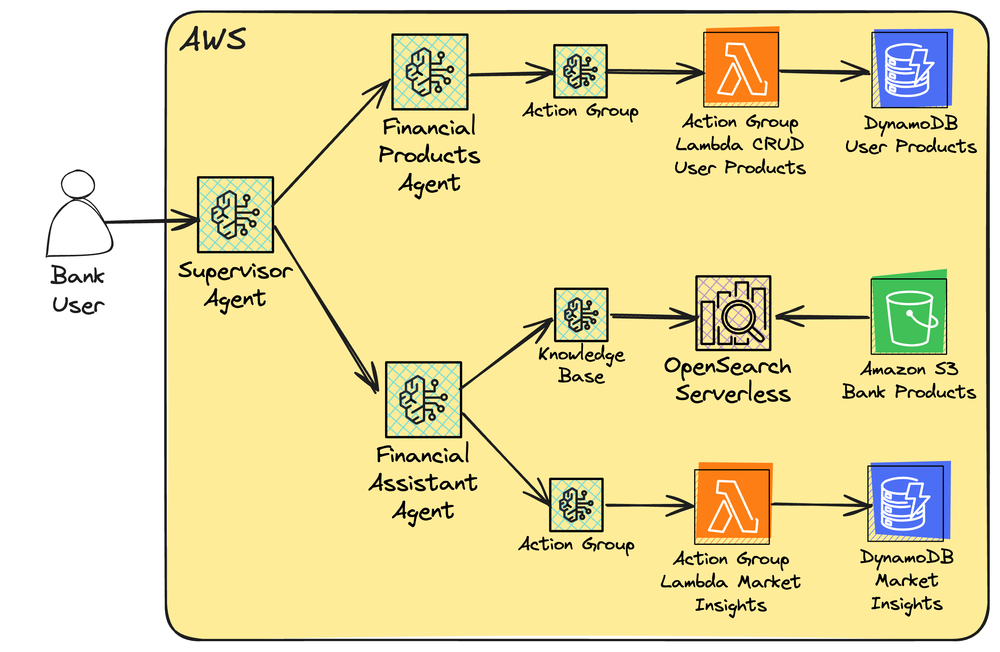
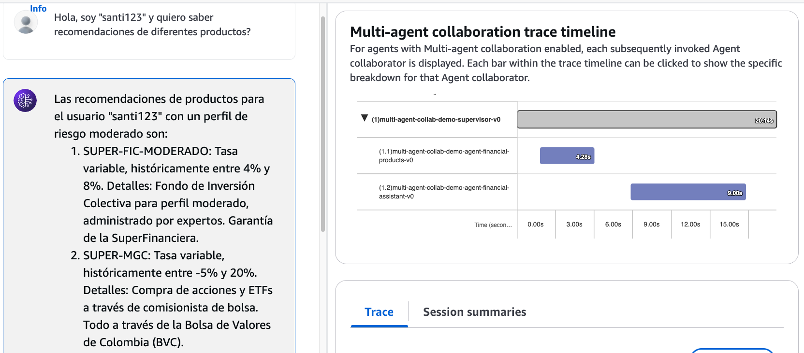

# :scroll: AWS-MULTI-AGENT-COLLABORATION-DEMO :scroll:

Multi Agent DEMO on AWS, serving as a bank supervisor agent that contains the following entities:

- Financial Products Agent:

  - Action Group: with connectivity to financial products (DB-based)

- Financial Assistant Agent:

  - Action Group: with access to latest market insights (API-based)
  - Knowledge Base: with access to all bank's products (OpenSearch + S3-based)

This DEMO enables the collaboration of agents via the [multi-agent-collaboration-capability](https://aws.amazon.com/blogs/aws/introducing-multi-agent-collaboration-capability-for-amazon-bedrock/) for Bedrock released on re:Invent 2024.

> Feel free to clone it and extend it to your own company information/data (at your own risk/responsibility)

## Architecture :memo:

  

## DEMO

<video src="assets/2025_01_29_MultiAgent_DEMO_VIDEO.mp4" controls width=90%>  

  

- Source video: [Video File](assets/2025_01_29_MultiAgent_DEMO_VIDEO.mp4)

## Manual Steps

As Bedrock Agents are newly released, not ALL the necessary AWS-SKDs and CDK/CloudFormation constructs/resources are available. Thus, I created the "manual guide" for the last steps needed to run this demo (just a couple steps for now).

- [MANUAL STEPS](./MANUAL_STEPS.md)

## Shoutouts 🙌

Thanks for all the inspiration and guidance on the Generative AI journey:

- [Antje Barth](https://github.com/antje) -> Principal Developer Advocate for generative AI at AWS

## Author 🎹

### Santiago Garcia Arango

<table border="1">
    <tr>
        <td>
            
Curious Solutions Architect experienced in DevOps and passionate about advanced cloud-based solutions and deployments in AWS. I am convinced that today's greatest challenges must be solved by people that love what they do.

        </td>
        <td>
            

        </td>
    </tr>
</table>

## LICENSE

Copyright 2025 Santiago Garcia Arango.
